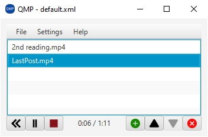
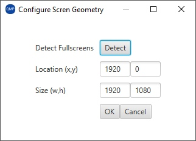
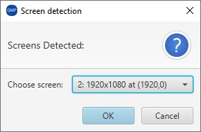

# QMP
Quick Media Player - A JavaFX based media launcher for live settings

## Introduction

The need for this came about when streaming church services during
lockdown. It turned out surprisingly difficult to drag a media
player into the right place on an extended desktop, maximise it to
fill the screen, and get it playing, in a professional looking way.

So that's what QMP helps with: it lets you build a list of media clips
you may want to play, and launch each with a double click at a
pre-defined location, scaled to a given size, in a border-less
window.

I've been developing on Windows, but being JavaFX-based, hopefully
it will work on other platforms, either out of the box, or with
potential to fix up without too much pain (certainly compared to
other movie player projects I tried to use.

It was written to an urgent deadline, so is
untidy here and there, and there is low-hanging fruit for some
quick-fixes if anyone fancies it. (eg, Hacktoberfest!)

## Usage

* You'll need a Java Development Kit with JavaFX. My favourite is
[Azul's Zulu Java](https://www.azul.com/downloads/?version=java-8-lts&package=jdk-fx)
who offer builds for Windows, Linux and MacOS, in x86/x64/ARM flavours. I have
been developing with Java 8 LTS. Or choose your favourite; in the end, I'd like
a JavaFX capable `javac` on the command-line, in order to...

* Clone the repo, and run `compile.bat` or `compile.sh` for the extremely simple
compile script. I know I should learn to use gradle or some such, but really, the
effort for such a simple compilation is currently beyond my stamina.

* Use `run.bat` or `run.sh` to launch - again, very simple.

### Main screen

* You can manage playlists (new, load, save/as) from the File menu.
* Add movies by dragging them from another window onto the list,
or use the add button.
* Re-order movies (just for your convenience) with the up/down
buttons.
* Remove movies from the list with the delete button.
* Play movies by doubling clicking them, or highlighting them
and clicking the play button.
* The Play turns into pause while the movie plays, and turns
into resume if you pause the movie.
* Left-most button rewinds a movie at any time.
* The stop button stops the movie and removes the movie window.

### Settings

* Settings -> Screen Settings is the only option so far.

* Fairly simple - you can manually set the location and
size of the video playind window (when it appears), or
you can autodetect monitors, and pick a full-screen one.

## Issues to fix:

See the issues list, or create new ones!

* Automatic check/install updates would be great, and fairly easy.
* There are issues with filenames containing quotes or special characters.
* There are issues with playing MOVs created with Apple devices, which
sometimes can be fixed by renaming them to MP4...
* There are also codec issues with more recent Apple devices, which can
be fixed with conversion through ffmpeg.
* There are no tests. Because I don't really know how to do this in
JavaFX, so I am only doing human testing. This would be good to learn.

## Known Issues I'm not sure how to fix.

* The interface on Windows supports dragging and dropping movies
  into the playlist - however this *does not* work if you run as
  administrator. Not sure exactly why you would, but perhaps this
  happens accidentally.
